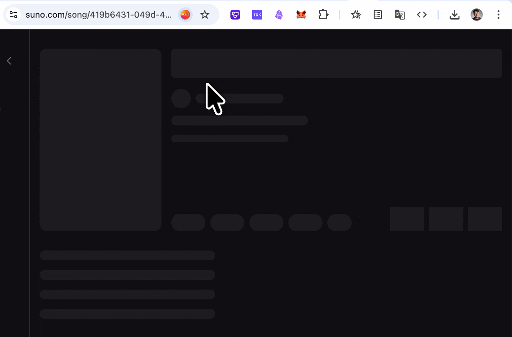

# Suno Lyric Downloader

Download synchronized lyrics from Suno song pages as `LRC` or `SRT` files.

**Language**

- English
- [中文](#中文使用手册)



---

## English User Guide

Suno Lyric Downloader is a Chrome extension for downloading synchronized lyrics from Suno song pages. When you open a Suno song detail page, the extension adds two compact download buttons to the top of the song cover:

- `LRC`: best for music players, scrolling lyrics, karaoke, and local music libraries.
- `SRT`: best for video subtitles, video editors, caption workflows, and social media videos.

You do not need to copy lyrics manually or align timestamps yourself. Log in to Suno, open a song page, and click the format you need.

### Supported Pages

The extension works on Suno song detail pages. The URL usually looks like this:

```text
https://suno.com/song/{song-id}
```

The buttons will not appear on the Suno home page, creation page, playlist pages, or other non-song pages.

### Installation

#### Option 1: Install From Chrome Web Store

This is the recommended installation method for most users.

1. Open [Suno Lyric Downloader on Chrome Web Store](https://chromewebstore.google.com/detail/suno-lyric-downloader/hhplbhnaldbldkgfkcfjklfneggokijm).
2. Click “Add to Chrome” or “Add to Desktop”.
3. Confirm the installation in Chrome.
4. Open a Suno song page and start downloading lyrics.

#### Option 2: Install From Source

This option is useful for developers or users who want to load the extension manually.

1. Clone the repository:

   ```bash
   git clone git@github.com:zh30/get-suno-lyric.git
   cd get-suno-lyric
   ```

2. Install dependencies:

   ```bash
   pnpm install
   ```

3. Build the extension:

   ```bash
   pnpm build
   ```

4. Load it in Chrome:

   - Open `chrome://extensions/`
   - Enable “Developer mode” in the top-right corner
   - Click “Load unpacked”
   - Select the generated `dist` folder

#### Option 3: Install From a Release Package

If you have a packaged extension folder, unzip it first. Then open `chrome://extensions/`, click “Load unpacked”, and select the unzipped extension folder.

### How to Use

1. Open [Suno](https://suno.com/) and sign in.
2. Open any song detail page, such as `https://suno.com/song/...`.
3. Wait for the song cover to finish loading.
4. Find the `LRC` and `SRT` buttons at the top of the song cover.
5. Click `LRC` to download LRC lyrics, or click `SRT` to download SRT subtitles.

Downloaded files include the song ID and format extension, for example:

```text
abc123-lyrics-suno-lyric-downloader.lrc
abc123-lyrics-suno-lyric-downloader.srt
```

### Choosing LRC or SRT

| Format | Best For | Example |
| --- | --- | --- |
| `LRC` | Music players, scrolling lyrics, karaoke, local music libraries | `[00:12.34]Hello world` |
| `SRT` | Video subtitles, video editors, caption tools, YouTube/TikTok/Reels captions | `00:00:12,340 --> 00:00:15,670` |

### Troubleshooting

#### I do not see the download buttons

Check the following:

1. Make sure the current page is a `https://suno.com/song/...` song detail page.
2. Make sure you are signed in to Suno.
3. Wait until the song cover has loaded.
4. Make sure the extension is enabled in Chrome.
5. If you rebuilt the project, refresh the extension on `chrome://extensions/`.
6. Refresh the Suno page or reopen the song detail page.

#### Why do some songs not show buttons?

The extension only shows buttons when synchronized lyric timing data is available. If a song only has plain text lyrics, or if Suno does not return usable aligned lyric data, the extension avoids generating inaccurate timestamp files.

#### I clicked a button, but no file downloaded

Check whether Chrome blocked the download or whether your browser has download restrictions enabled. You can also open Chrome’s download history to see whether the file was downloaded.

#### Does the extension ask me to log in again?

No. The extension uses your existing Suno session in the browser. If you are not signed in to Suno, it cannot access lyric data that requires a logged-in session.

### Privacy and Security

- The extension only runs on `https://suno.com/*`.
- It uses your existing Suno browser session and never asks for your username or password.
- Lyric processing and file generation happen locally in your browser.
- The project does not run its own server and does not collect or upload your song data.

### Support the Project

Suno Lyric Downloader is free, open source, and maintained in my spare time. If this extension saves you time or becomes part of your workflow, you can support its ongoing development through [GitHub Sponsors](https://github.com/sponsors/zh30).

Sponsorship is optional, but it helps me keep the extension updated as Suno changes, fix issues faster, and continue improving the user experience.

### Developer Commands

```bash
# Install dependencies
pnpm install

# Development build with watch mode
pnpm dev

# Production build
pnpm build

# TypeScript type checking
pnpm tsc

# Create a Chrome Web Store ZIP package
pnpm zip
```

After changing code, rebuild the extension:

```bash
pnpm build
```

Then refresh the extension on `chrome://extensions/`.

---

## 中文使用手册

[Back to English](#english-user-guide)

Suno Lyric Downloader 是一个 Chrome 浏览器扩展。打开 Suno 歌曲详情页后，它会自动在歌曲封面顶部显示两个下载按钮：

- `LRC`：适合音乐播放器、歌词滚动、卡拉 OK 和本地音乐库。
- `SRT`：适合视频字幕、剪辑软件、字幕编辑器和社交媒体视频。

你不需要复制歌词，也不需要手动对时间轴。只要登录 Suno，打开歌曲页面，然后点击需要的格式即可下载同步歌词文件。

### 适用页面

插件只会在 Suno 歌曲详情页工作，页面地址通常类似：

```text
https://suno.com/song/歌曲ID
```

如果你在 Suno 首页、创建页、歌单页或其他非歌曲详情页，插件按钮不会显示。

### 安装方式

#### 方式一：从 Chrome Web Store 安装

这是最推荐的安装方式，适合大多数普通用户。

1. 打开 [Chrome Web Store 上的 Suno Lyric Downloader](https://chromewebstore.google.com/detail/suno-lyric-downloader/hhplbhnaldbldkgfkcfjklfneggokijm)。
2. 点击“添加至 Chrome”或“Add to Desktop”。
3. 在 Chrome 中确认安装。
4. 打开 Suno 歌曲详情页，即可开始下载歌词。

#### 方式二：从源码安装

适合开发者或需要手动加载插件的用户。

1. 克隆项目：

   ```bash
   git clone git@github.com:zh30/get-suno-lyric.git
   cd get-suno-lyric
   ```

2. 安装依赖：

   ```bash
   pnpm install
   ```

3. 构建插件：

   ```bash
   pnpm build
   ```

4. 在 Chrome 中加载插件：

   - 打开 `chrome://extensions/`
   - 打开右上角的“开发者模式”
   - 点击“加载已解压的扩展程序”
   - 选择本项目生成的 `dist` 文件夹

#### 方式三：从发布包安装

如果你拿到的是已经打包好的扩展文件，请先解压，然后在 `chrome://extensions/` 中通过“加载已解压的扩展程序”选择解压后的扩展目录。

### 使用步骤

1. 打开 [Suno](https://suno.com/) 并登录你的账号。
2. 进入任意歌曲详情页，例如 `https://suno.com/song/...`。
3. 等待歌曲封面加载完成。
4. 在歌曲封面顶部找到 `LRC` 和 `SRT` 两个下载按钮。
5. 点击 `LRC` 下载 LRC 歌词，或点击 `SRT` 下载 SRT 字幕。

下载后的文件名会包含歌曲 ID 和格式后缀，例如：

```text
abc123-lyrics-suno-歌词下载器.lrc
abc123-lyrics-suno-歌词下载器.srt
```

### 什么时候选择 LRC 或 SRT

| 格式 | 适合场景 | 示例 |
| --- | --- | --- |
| `LRC` | 音乐播放器、歌词滚动、卡拉 OK、本地音乐收藏 | `[00:12.34]Hello world` |
| `SRT` | 视频字幕、剪辑软件、字幕编辑器、YouTube/TikTok/Reels 字幕 | `00:00:12,340 --> 00:00:15,670` |

### 常见问题

#### 没有看到下载按钮怎么办？

请依次检查：

1. 当前页面是否是 `https://suno.com/song/...` 歌曲详情页。
2. 你是否已经登录 Suno。
3. 歌曲封面是否已经加载完成。
4. Chrome 扩展页面中插件是否处于启用状态。
5. 如果你刚刚重新构建过项目，请在 `chrome://extensions/` 中点击插件的刷新按钮。
6. 尝试刷新 Suno 页面，或重新打开歌曲详情页。

#### 为什么有些歌曲没有按钮？

插件只会在能获取到同步时间轴歌词时显示下载按钮。如果某首歌只有普通文本歌词，或者 Suno 没有返回可用的同步歌词数据，插件会避免生成不准确的时间轴文件。

#### 点击按钮后没有下载？

请检查 Chrome 是否阻止了下载，或当前浏览器是否有下载权限限制。你也可以打开 Chrome 下载记录页面确认文件是否已经下载。

#### 插件会要求我重新登录 Suno 吗？

不会。插件使用你浏览器中现有的 Suno 登录状态访问 Suno 的歌词接口。如果你没有登录 Suno，插件无法获取需要登录态的歌词数据。

### 隐私与安全

- 插件只在 `https://suno.com/*` 页面运行。
- 插件使用你当前浏览器里的 Suno 登录状态，不会要求你输入账号或密码。
- 歌词处理和文件生成在本地浏览器中完成。
- 项目没有自己的服务器，也不会收集或上传你的歌曲数据。

### 赞助支持

Suno Lyric Downloader 是一个免费、开源，并由我长期维护的项目。如果这个插件节省了你的时间，或者已经成为你工作流的一部分，欢迎通过 [GitHub Sponsors](https://github.com/sponsors/zh30) 支持我继续维护它。

赞助完全自愿，但它能帮助我在 Suno 页面或接口变化时更快适配，持续修复问题，并继续优化使用体验。

### 开发者命令

```bash
# 安装依赖
pnpm install

# 开发模式构建并监听文件变化
pnpm dev

# 生产构建
pnpm build

# TypeScript 类型检查
pnpm tsc

# 打包 Chrome Web Store 发布 ZIP
pnpm zip
```

修改代码后，请重新运行：

```bash
pnpm build
```

然后到 `chrome://extensions/` 中刷新扩展。

## License

MIT
