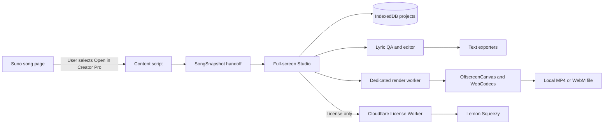

# Creator Pro Design Specification

- **Status:** Approved for implementation planning
- **Date:** 2026-07-12
- **Product:** Suno Lyric Downloader
- **Current extension version:** 2.0.9
- **Commercial model:** Local-first, one-time purchase
- **Launch price:** USD 59
- **Regular price:** USD 79

## 1. Executive Summary

Creator Pro extends Suno Lyric Downloader from a reliable synchronized-lyric downloader into a local production workspace for creators who publish Suno songs as videos, subtitles, karaoke content, or reusable lyric assets.

The free extension keeps its current LRC and SRT download behavior. Creator Pro adds a user-initiated full-screen workspace with two modes that share one canonical lyric project:

1. **Lyric Studio** detects and repairs text, line, word, and timing problems, then exports editor-ready lyric and subtitle formats.
2. **Video Studio** uses the corrected lyric project to create template-based 1080p lyric videos locally, without uploading songs or lyrics.

The product uses Lemon Squeezy for checkout and license creation. A minimal Cloudflare Worker validates licenses and issues locally verifiable signed entitlements. Song data, lyric data, audio, projects, and rendered videos never reach the licensing service.

The primary product promise is:

> Buy once and turn each Suno song into accurate, professional, publish-ready lyric videos and subtitle packages without re-transcribing or re-timing it in multiple tools.

## 2. Context and Product Rationale

The existing extension solves lyric acquisition. It has approximately 5,000 Chrome Web Store users and a clear privacy promise: local processing, no product account, and no developer-operated song-data service.

Public workflow research identified the paid problem after download:

- Known lyrics and Suno's aligned data can disagree through missing, repeated, or fragmented lines.
- Global offsets, local timing drift, line boundaries, and repeated sections still require manual repair.
- LRC, SRT, VTT, ASS, and video editors preserve different subsets of timing and styling information.
- Automatic music transcription is often a poor substitute for the lyrics and alignment data the creator already has.
- Creators report spending hours on timing, correction, styling, and platform-specific exports.

Creator Pro monetizes finishing and reuse rather than taking away the free acquisition feature that established trust.

## 3. Goals

### 3.1 Product Goals

- Preserve the existing free LRC and SRT downloads without reduced quality, artificial limits, or forced account creation.
- Let a creator open the current Suno song in a dedicated full-screen workspace with the best available lyric, word, waveform, and metadata snapshot.
- Create one canonical, editable lyric project that drives every text and video output.
- Detect common lyric and timing defects before the user imports an inaccurate file elsewhere.
- Make precise line-level repair fast and word-level repair available when trustworthy source timing exists.
- Export reliable presets for common creator destinations.
- Generate a useful 1080p lyric video from a static visual background entirely on the user's machine.
- Charge a high-confidence one-time price without introducing a product account or cloud song processing.

### 3.2 Trust Goals

- Show value before presenting the purchase gate.
- State the price, license scope, networking behavior, and refund policy before checkout.
- Collect no hardware fingerprint and no automatic in-product behavioral analytics.
- Send no song, lyric, audio, project, or browsing data to developer-controlled services. Import may communicate directly with Suno through the user's existing signed-in session.
- Transmit to developer-controlled services only the information needed to create checkout requests and validate licenses.
- Keep free users productive and avoid recurring upgrade interruptions.

### 3.3 Success Criteria

During the closed beta:

- At least 80% of testers successfully export either a professional lyric package or a lyric video, measured from a structured completion checklist for each invited tester.
- At least 95% of valid test purchases activate successfully without developer intervention, measured as successful entitlement issuances divided by completed test orders.
- Median time from opening a supported song to the first usable output is below 15 minutes, measured during scheduled beta tasks or from tester-submitted start and completion times.
- No edit or render failure causes loss of previously saved project data.
- A three-minute 1080p horizontal and vertical video produces a usable output format on a mid-range Windows device, an Intel Mac, and an Apple Silicon Mac.

After public release:

- Checkout conversion begins at or above 2%, measured as completed purchases divided by unique opaque checkout requests created by the License Worker. This does not measure passive upgrade-screen views.
- Refund rate, measured from Lemon Squeezy refunds divided by completed purchases, remains below 5%.
- License-related support requests, counted manually and divided by completed purchases, remain below 10%.
- Repeat value is assessed through an optional 14-day purchaser follow-up survey and closed-beta interviews, not through automatic project-open or export telemetry.

## 4. Non-Goals for Creator Pro 1.0

Creator Pro 1.0 will not include:

- Background video import, trimming, looping, decoding, or compositing.
- 4K, 60 fps, transparent video, ProRes, HEVC, or MOV export.
- A general-purpose multi-track video editor.
- Cloud project sync, collaboration, shared workspaces, or team accounts.
- Cloud AI transcription, translation, or audio generation.
- Repair of words that Suno sang incorrectly in the audio.
- Whole-library scraping, bulk Suno song processing, or automated account backup.
- Guaranteed MP4 support on every device.
- Guaranteed export faster than song duration.
- Hardware fingerprinting or physical-machine identity.
- Automatic upload of diagnostics or product behavior.

These exclusions preserve a narrow product purpose, avoid competing with general video editors, reduce Chrome Web Store policy risk, and keep the one-person operating model sustainable.

## 5. Target Users and Jobs

### 5.1 Primary User

A solo creator who has a Suno song they want to publish on YouTube, TikTok, Reels, Shorts, or another music/video channel.

Their core job is:

> Turn the song I already accepted into accurate, synchronized, professional lyric assets without repeating transcription and timing work in every downstream tool.

### 5.2 Secondary Users

- Karaoke and enhanced-LRC creators who need line or word timing.
- High-volume Suno creators who reuse corrected lyrics across several platforms.
- Local music collectors who need accurate, compatible lyric files.
- Multilingual creators who may later benefit from parallel original, transliteration, and translation tracks.

The 1.0 interface and marketing optimize for the primary creator, not for library-management or team workflows.

## 6. Commercial Design

### 6.1 Free and Paid Boundary

| Capability | Free | Creator Pro |
| --- | --- | --- |
| Current-song LRC download | Yes | Yes |
| Current-song SRT download | Yes | Yes |
| Existing automatic timing repair | Yes | Yes |
| Open current song in full-screen Studio | Preview | Full |
| View lyric QA report | Yes | Yes |
| Preview included video templates | Yes | Yes |
| Edit and save projects | No | Yes |
| Professional format presets | No | Yes |
| Word-level editing and Enhanced LRC | No | Yes, when source data supports it |
| Local lyric-video rendering | Preview only | Unlimited, no watermark |
| License activations | Not applicable | Two Chrome installations |

Free users must never lose the current download formats or receive intentionally degraded timing.

### 6.2 Price and Entitlement

- Launch price is USD 59 for the first 30 days after public release.
- The UI displays the USD 79 regular price and labels USD 59 as the launch price.
- The launch period uses a published end date. It does not use a countdown animation, fake inventory, or fabricated urgency.
- Regular price is USD 79 after the launch period.
- A purchase grants perpetual use of all Creator Pro 1.x features included in the installed extension.
- A future 2.0 may be a voluntary paid upgrade. Existing 1.x capabilities remain usable.
- One license supports two Chrome installation instances. The product does not claim to identify two physical computers.

### 6.3 Refund Policy

- Purchasers receive a voluntary 14-day refund period.
- Lemon Squeezy processes the refund.
- A refunded or charged-back license becomes revoked at the next successful license refresh.
- Previously exported files remain the user's files.
- Refunds do not require the user to send songs, lyrics, or private project data.
- An optional, non-identifying refund reason may be collected through Lemon Squeezy.

The product accepts limited refund abuse as a lower cost than making legitimate buyers distrust the purchase.

## 7. Primary User Journey

### 7.1 Discover and Preview

1. The user opens a supported Suno song detail page.
2. Existing LRC and SRT buttons remain visible.
3. A secondary `Open in Creator Pro` action appears without covering Suno controls.
4. The extension creates a local snapshot of the current song and opens the full-screen Studio extension page.
5. Studio displays a free QA report and lets the user preview included lyric-video templates.

### 7.2 High-Intent Purchase Gate

The purchase gate appears only when the user attempts to:

- Apply a lyric or timing repair.
- Save the editable project.
- Export a professional lyric package.
- Render a full-resolution, unwatermarked video.

The purchase surface states:

- USD 59 launch price and USD 79 regular price.
- One-time purchase for Creator Pro 1.x.
- Two Chrome installations.
- No song or lyric uploads.
- Lemon Squeezy handles payment in a new tab.
- `I already have a license` remains available.

### 7.3 Purchase and Activation

1. Studio creates an opaque, single-use checkout request with the License Worker. The request is bound to the local installation-ID hash and contains no song or project data.
2. The Worker returns a Lemon Squeezy hosted-checkout URL containing only the opaque request ID as custom checkout data. Studio keeps the one-time redemption secret locally and opens checkout in a new tab.
3. Lemon Squeezy emails the generated License Key. Its signed order webhook delivers the opaque request ID to the Worker.
4. The Worker verifies the webhook, store, product, variant, order, and license, then activates the pending Chrome installation.
5. The original Studio tab polls the pending request with the locally held one-time secret and receives the signed entitlement when ready. The License Key never appears in a URL.
6. The request expires after 30 minutes and becomes unusable immediately after successful redemption. Expired, replayed, mismatched, and canceled requests return explicit non-sensitive states.
7. If automatic activation fails, the user pastes the License Key from the receipt into Studio for the manual activation flow.
8. The successful state shows installation usage, offline readiness, and a direct return to the interrupted action.

### 7.4 Edit Once, Produce Two Outputs

1. The user resolves QA issues in Lyric Studio.
2. All changes update the canonical `LyricProject`.
3. The user either exports a professional lyric package or switches to Video Studio.
4. Video Studio uses the same corrected lyrics and playhead without re-importing or re-aligning.
5. The project autosaves locally and can be reopened for later exports.

## 8. Information Architecture and Interaction Design

### 8.1 Entry Surfaces

- **Suno song overlay:** existing LRC and SRT actions plus a secondary Creator Pro entry.
- **Extension popup:** current help remains; licensed users also receive `Open recent project` and license status.
- **Full-screen Studio:** a packaged extension page opened in a new browser tab.

The unused side panel is not repurposed for Creator Pro 1.0 because the approved workflow needs a full-width waveform, issue queue, inspector, and video preview.

### 8.2 Shared Production Desk Shell

Lyrics and Video are modes inside one stable shell, not separate products.

The persistent header contains:

- Product and project name.
- Local save state.
- License state when action is needed.
- Primary Export action.

The workspace uses three regions:

1. **Left panel:** issue queue in Lyrics mode; template browser in Video mode.
2. **Center workspace:** waveform and lyric rows in Lyrics mode; video canvas and compact timeline in Video mode.
3. **Right inspector:** selected line timing and repair controls in Lyrics mode; template and style controls in Video mode.

Switching modes preserves:

- Current song and project.
- Playhead position and playback state.
- Selected lyric line.
- Undo and redo history.
- Project save status.

### 8.3 Visual Language

Creator Pro extends the existing extension's visual language:

- Dark neutral surfaces.
- White primary text and neutral secondary text.
- Emerald primary actions and success states.
- Amber warnings and red blocking errors.
- Compact rounded controls and cards.
- System sans-serif typography.

The design does not introduce an unrelated brand system. Keyboard focus, contrast, reduced-motion preferences, accessible labels, and non-color error indicators are required.

## 9. Functional Requirements

### 9.1 Song Import

For the current user-selected Suno song, the extension captures the best available values for:

- Song ID.
- Title.
- Duration.
- Cover reference.
- Original prompt lyrics.
- Aligned lyric lines.
- Aligned word tokens.
- Waveform samples.
- Audio reference when available to the signed-in user.

Import is explicitly initiated by the user. Creator Pro does not crawl playlists or the library.

If Suno audio cannot be fetched reliably, Studio asks the user to select a local audio file. Lyric editing and text export remain available when video rendering is not.

### 9.2 Lyric QA

Creator Pro 1.0 uses deterministic local rules. It does not send lyrics to an AI service.

The QA engine detects:

- Prompt lines missing from aligned output.
- Exact or near-exact adjacent duplicates.
- Non-monotonic start times.
- Lines with an end time before or equal to the start time.
- Overlapping adjacent lines beyond a small timing tolerance.
- Suspiciously long gaps between sung lines.
- Implausibly short or long line durations relative to lyric length and neighboring lines.
- Fragmented line continuations likely to require merging.
- Word timings outside their parent line.
- Low word-timing coverage that makes word-level output unsafe.
- Lines or words outside the song duration.

Each issue has a stable code, severity, evidence, affected range, and one or more explicit repair actions. QA never silently overwrites user-corrected data.

### 9.3 Lyric Editing

Required line-level actions:

- Edit lyric text.
- Shift all timestamps by a signed offset.
- Shift a selected range.
- Set a line start or end.
- Drag a line boundary on the waveform.
- Merge adjacent lines.
- Split a line at a text cursor and selected time.
- Insert a missing line using a locally estimated initial range.
- Delete an erroneous line with undo support.
- Loop the selected line.
- Play at 0.5x, 0.75x, 1x, and 1.25x without intentional pitch change when the browser supports it.
- Move to the next or previous issue from the keyboard.
- Undo and redo every project mutation.

Word-level actions are enabled only when source coverage and ordering pass QA:

- Adjust a word start or end.
- Move a word boundary without crossing neighboring words.
- Split or merge word tokens while preserving the containing line.
- Fall back to line-level timing when word data becomes invalid.

### 9.4 Professional Text Export

Creator Pro exports:

- LRC.
- Enhanced LRC when valid word timing exists.
- SRT.
- WebVTT.
- ASS.

Export presets provide safe defaults for:

- CapCut.
- Adobe Premiere Pro.
- DaVinci Resolve.
- YouTube.
- Generic music-player LRC.

Presets define format, line grouping, timestamp precision, tag handling, and supported styling. They do not claim to preserve unsupported features in a target application.

Every export runs validation first. Blocking format errors must be resolved or explicitly downgraded. The user can export a package containing multiple formats without repeating edits.

### 9.5 Video Templates

Creator Pro 1.0 supports:

- A user-selected background image.
- A solid background color.
- Packaged gradient backgrounds.
- Packaged and properly licensed fonts, plus safe system-font fallbacks.
- Song title and optional cover treatment.
- Line-level and word-highlight lyric presentation.
- Configurable text position, size, alignment, primary color, inactive color, highlight color, shadow, and safe-area margins.
- Packaged template motion that does not require arbitrary user keyframes.
- 1920x1080 and 1080x1920 output.
- Fixed 30 fps output.
- Low-resolution real-time preview.
- Unlimited local re-rendering without credits or watermarks.

Output preference is MP4 with H.264 video and AAC audio when the browser reports support. The required fallback is WebM with a supported VP8 or VP9 video configuration and Opus audio.

Before rendering, Studio shows the chosen container, codec, resolution, estimated compatibility, and local destination. The UI must not promise MP4 when runtime capability detection fails.

### 9.6 Project Persistence

- Projects autosave after each committed mutation using a short debounce.
- The immutable imported snapshot is retained separately from the editable state.
- A saved project includes lyric state, QA state, template state, revisions, and recent export preferences.
- Audio and large rendered data are not stored in `chrome.storage`.
- Users can rename, duplicate, export, delete, or clear all local projects.
- Project schemas include an integer version and deterministic forward migrations.
- A failed migration leaves the original local record intact and offers a diagnostic export.

## 10. Canonical Data Model

The implementation plan may refine property names, but it must preserve these boundaries.

### 10.1 Song Snapshot

`SongSnapshot` is an immutable record of data imported from the user-selected song:

- Source provider and song ID.
- Import timestamp.
- Title, duration, cover reference, and audio reference.
- Prompt lyric text.
- Source aligned lines and source aligned words.
- Waveform samples.
- Source-data capability flags.

### 10.2 Lyric Project

`LyricProject` is the authoritative user-owned project:

- Project ID and schema version.
- Immutable source snapshot reference.
- Ordered lyric sections, lines, and words with stable IDs.
- Current text and timing.
- Provenance for imported, repaired, and user-edited values.
- QA findings and resolution state.
- Revision history.
- Video-template configuration.
- Local media handle metadata.
- Export preferences and non-sensitive export history.

### 10.3 Timing Invariants

- All stored times use seconds as finite numbers with millisecond precision at project boundaries.
- A word belongs to exactly one line.
- A line belongs to exactly one section or an explicit unsectioned group.
- Starts are non-negative and do not exceed song duration.
- Ends are greater than starts.
- Word ranges remain within their parent line after validation.
- User edits take precedence over automatic repair until explicitly reset.

### 10.4 License Entitlement

The locally stored signed entitlement contains only:

- Entitlement schema version.
- License record ID, not the raw License Key.
- Random installation ID hash.
- Product and variant identifiers.
- Enabled feature set.
- Issued, last-verified, and next-refresh timestamps. `next-refresh` schedules a soft status check and is not a local-feature expiration.
- Lemon Squeezy instance ID.
- Signature.

It contains no customer name, email, order payment data, lyrics, song IDs, or browsing data.

## 11. System Architecture

### 11.1 Content Script

Responsibilities:

- Detect the supported current-song context.
- Obtain the current song's permitted Suno data through the existing background request boundary and the user's active Suno session.
- Preserve source word timing and waveform data rather than flattening them prematurely.
- Add the non-blocking Creator Pro entry.
- Send a bounded snapshot to the extension-origin handoff.

It must not own project persistence, licensing, editing, or rendering.

The Suno session token is used only in memory for the user-initiated Suno request. It must never be stored, included in diagnostics, written to logs, or sent to a developer-controlled service. Existing cookie-value debug logging must be removed before any Creator Pro release.

### 11.2 Extension Service Worker

Responsibilities:

- Keep the existing narrowly scoped Suno request proxy.
- Send current-song requests directly to Suno, not through the License Worker or another developer-controlled data service.
- Validate messages and current-song scope.
- Open the packaged Studio page.
- Coordinate short-lived project handoff identifiers.

It must not perform long-running rendering because Manifest V3 service-worker lifetime is unsuitable for that work.

### 11.3 Full-Screen Studio

Responsibilities:

- Load or create projects.
- Manage the shared Production Desk UI.
- Coordinate playback, selection, QA, editing, autosave, preview, and export.
- Start render jobs from a user gesture.
- Surface capability checks and recoverable errors.

### 11.4 Local Storage

- IndexedDB stores projects, revisions, template configuration, and non-sensitive entitlement state.
- `chrome.storage.local` stores small extension settings, a random installation ID, and the current signed entitlement.
- `chrome.storage.session` may carry a short-lived handoff project ID.
- OPFS or a user-selected File System Access handle may hold large temporary render data.
- Audio and final videos must not be accumulated as a complete in-memory Blob for long songs.

### 11.5 Render Worker

A Dedicated Worker performs deterministic frame production and encoding:

- OffscreenCanvas composes backgrounds, title treatment, lyric lines, and word highlights.
- A packaged demuxer reads supported local or fetched audio containers without remote code.
- WebCodecs `AudioDecoder` decodes supported audio frames; a bounded local resampling stage converts them to an encoder-supported sample rate and channel layout when required.
- OffscreenCanvas and WebCodecs produce capability-checked video frames and encoded video chunks.
- WebCodecs `AudioEncoder` produces capability-checked audio chunks using timestamps derived from the decoded source timeline.
- A packaged TypeScript muxer interleaves encoded audio and video into MP4 or WebM incrementally.
- Encoded chunks stream to the selected file or bounded temporary storage.
- The worker limits encode queue depth and closes frame resources immediately.

The complete media path is `authenticated Suno fetch or user-selected file -> container detection -> demux -> audio decode -> bounded resample -> audio encode`, in parallel with deterministic lyric-frame rendering and video encoding, followed by timestamp-ordered incremental muxing. A signed or authenticated Suno URL is never persisted as a durable project credential. Fetch, CORS, or authentication failure falls back to user-selected local audio.

For the three-minute validation fixture, peak additional render working memory should remain below 512 MiB and final audio/video end-time drift must remain at or below 50 ms. Failure to meet these thresholds blocks the approved browser renderer from public release and requires a revised design decision.

`ffmpeg.wasm` is not the primary renderer because of package size, memory, performance, cross-origin-isolation, and Manifest V3 remote-code constraints. It may be evaluated later for a narrowly bounded compatibility fallback only.

## 12. Payment and License Architecture

### 12.1 Lemon Squeezy Configuration

- Product type is a single payment.
- License Keys are enabled.
- Activation limit is two.
- Product and variant IDs are fixed in configuration and checked by the Worker.
- Checkout is hosted by Lemon Squeezy.
- Webhooks cover completed orders, refunds, chargebacks, and license status changes.

### 12.2 Installation Identity

On first activation, the extension creates a random UUID with `crypto.randomUUID()` and stores it locally.

- The UUID identifies a Chrome installation, not a physical device or person.
- No Canvas, WebGL, fonts, serial numbers, network interfaces, or other fingerprint inputs are collected.
- Two Chrome profiles may count as two installations.
- An uninstall and reinstall may create a new installation.
- The UI and sales terms say `two Chrome installations`.

### 12.3 Activation Flow

Automatic activation uses the short-lived checkout-request protocol defined in Section 7.3. Manual activation follows these steps:

1. The extension sends the user-entered License Key, random installation ID, extension version, and a user-editable coarse installation label to the License Worker over HTTPS.
2. The Worker rate-limits and validates the request.
3. The Worker calls Lemon Squeezy activation with a non-sensitive instance label.
4. The Worker verifies store, product, variant, status, and activation usage.
5. The Worker stores only the required license record ID, Lemon Squeezy instance ID, installation-ID hash, status, and timestamps in D1.
6. The raw License Key is never written to D1, a URL, analytics, or application logs.
7. The Worker signs an entitlement with an Ed25519 private key held as a Worker secret.
8. The extension verifies the entitlement with a packaged public key and binds it to the local installation ID.

Automatic checkout requests use at least 128 bits of cryptographic randomness, expire after 30 minutes, are single-use, and bind the order to the initiating installation. Integration tests cover expiration, replay, wrong installation, wrong product, invalid webhook signature, canceled checkout, and delayed webhook delivery.

### 12.4 Refresh and Offline Use

- The extension attempts a quiet refresh every 30 days and after relevant license errors when the network is available.
- A last-known-valid perpetual Creator Pro 1.x entitlement has no hard offline expiration. License-service downtime or loss of network access must not disable purchased local features.
- The Worker uses Lemon Squeezy's authenticated API and stored license record ID for later status checks; the extension does not need to retain the raw License Key after activation.
- Refunds, chargebacks, and disabled licenses revoke access only after the extension receives and verifies a successful signed status response from the Worker.
- The product does not force an online check on every launch or export.

This deliberately favors the perpetual local-software promise over aggressive DRM. A purchaser who permanently blocks network access may retain the last-known-valid state after a later refund; the design accepts that limited abuse rather than making honest customers depend on the continuing availability of the licensing service.

### 12.5 Installation Management

The license surface lists non-sensitive installation labels and activation dates. The holder of the License Key can:

- Rename the current installation.
- Deactivate the current installation.
- Release another installation.
- Replace the oldest installation when the activation limit is reached.

License management requires possession of the License Key or an already valid local entitlement. It does not require a product account.

## 13. Privacy and Security

### 13.1 Data Not Sent to Developer-Controlled Services

- Lyrics and prompts.
- Song IDs and Suno URLs, except when used in direct requests to Suno for the user-facing import feature.
- Audio, waveform, cover, and rendered video content.
- Project data and revision history.
- Export files and local paths.
- Product usage behavior.
- Diagnostic reports unless the user explicitly sends one outside the product.

Current-song import communicates directly with Suno using the user's existing session. The extension may receive website content from Suno and process it locally, which must be disclosed accurately under Chrome Web Store user-data requirements. No Suno session token, request body, song content, or response is relayed through the License Worker.

### 13.2 License Data

The licensing service may handle only:

- Lemon Squeezy license record and instance identifiers.
- Random installation-ID hash.
- License state and timestamps.
- Product variant and extension version required for compatibility and fraud control.

It does not collect a hardware fingerprint, browsing history, or precise location. Payment and customer records remain in Lemon Squeezy rather than the extension database.

### 13.3 Diagnostics

Studio can generate a local diagnostic report that the user previews before copying or downloading it. It includes:

- Extension and Chrome versions.
- Coarse operating-system family.
- Runtime codec capability matrix.
- Render stage, duration, and error codes.
- Project schema version.

It automatically excludes lyrics, title, Suno ID, URLs, audio, License Key, installation ID, and local file paths.

### 13.4 Store and Policy Disclosure

Before release, update:

- Chrome Web Store paid-feature description.
- Privacy disclosures.
- Public privacy policy.
- Terms of sale and refund policy.
- In-product explanation of local processing and license networking.

The accurate promise is `song data is processed locally and requested directly from Suno through your existing session; no song data is sent to the developer or licensing provider`, not `the extension never connects to any server`.

## 14. Error Handling and Degradation

### 14.1 Source Data

- **No synchronized lyrics:** retain existing free behavior and explain that Studio cannot create a timed project from this song.
- **Line timing only:** allow line editing and line-based video; disable word editing and Enhanced LRC.
- **Low word coverage:** explain the confidence failure and use line-level highlighting.
- **Missing Suno audio:** prompt for a local audio file; retain text editing and text export.
- **Suno API or UI change:** isolate the compatibility failure from saved local projects and free-format converters.

### 14.2 Project and Storage

- Autosave mutations before long-running work.
- Keep the imported snapshot immutable.
- Preserve the original record if schema migration fails.
- Detect storage quota failure before accepting a large local asset.
- Offer project export and cleanup rather than silently deleting data.

### 14.3 Rendering

- Check input decoding and output encoding capabilities before rendering.
- Prefer MP4 only when the required configuration is supported.
- Offer WebM when MP4 is unavailable.
- Show progress by frames and song time without claiming a fixed completion speed.
- On failure, keep the project, report the failed stage, and offer compatible settings.
- Closing Studio stops rendering; the UI warns before closing an active render.

### 14.4 Licensing

- **Worker unavailable with a last-known-valid entitlement:** continue paid local functionality indefinitely and retry quietly on the next scheduled opportunity.
- **Worker unavailable during first activation:** retain the License Key only in the activation form and allow retry.
- **Checkout request expired or replayed:** discard the request, preserve the purchase receipt path, and offer automatic retry or manual License Key entry.
- **Activation limit reached:** offer installation management and replace-oldest flow.
- **Refunded, disabled, or charged-back license:** explain the state without exposing provider internals and retain local project files.
- **Signature invalid:** disable paid execution, preserve data, and offer license refresh and diagnostics.

## 15. Testing Strategy

### 15.1 Pure Logic Tests

Continue the repository's existing `node:test` pattern for isolated TypeScript or compiled modules unless implementation planning demonstrates a strong reason to add another framework.

Required coverage includes:

- Snapshot normalization.
- Lyric QA rules.
- Line and word invariants.
- Every editor command and inverse undo command.
- Project migrations.
- LRC, Enhanced LRC, SRT, VTT, and ASS golden outputs.
- Target preset transformations.
- Entitlement signature, refresh scheduling, last-known-valid behavior, and explicit signed revocation.
- Diagnostic redaction.

### 15.2 Integration Tests

- Import snapshot to project to corrected text export.
- Import snapshot to project to template frame schedule.
- Autosave and crash/reload recovery.
- Purchase interruption to activation to resumed action.
- Checkout-request creation, expiration, single-use redemption, delayed webhook delivery, replay rejection, and manual-key fallback.
- First and second activation, third-install rejection, release, and replacement.
- Refund and disabled-license refresh behavior.
- MP4 capability success and WebM fallback.

### 15.3 Render Validation

Before committing to the video architecture, build a bounded technical spike that renders a three-minute, 1080p, 30 fps, static-background, word-highlight video.

Measure:

- Peak memory.
- Encode queue depth.
- Audio demux, decode, resample, encode, and mux compatibility.
- Output duration and audio/video synchronization.
- Time to first encoded chunk.
- Total render time.
- Browser responsiveness.
- Output playback in Chrome, QuickTime or Windows Media Player where applicable, VLC, and at least one target editor.

Run the spike on a mid-range Windows machine, Intel Mac, and Apple Silicon Mac. It must meet the 512 MiB additional-memory and 50 ms A/V end-time-drift thresholds defined in Section 11.5. Public marketing must not state a render-speed guarantee before this evidence exists.

### 15.4 Release Verification

Every release candidate runs:

- `pnpm tsc`
- Existing repository test scripts.
- New Creator Pro pure-logic and integration tests.
- `pnpm build`
- Manual unpacked-extension smoke tests for free download, Studio import, editing, export, rendering, activation, and offline behavior.

## 16. Delivery Sequence

The implementation is one product but is intentionally decomposed into independently testable increments:

0. **Video feasibility gate:** build the complete bounded audio/video spike first and validate 1080p rendering, memory, A/V synchronization, containers, and codec fallback across the target device matrix. If this gate fails, return to design before selling a product that promises Video Studio.
1. **Canonical project foundation:** preserve source words and waveform, define project schema, IndexedDB repository, migrations, command history, and QA tests.
2. **Lyric Studio:** full-screen shell, issue queue, waveform playback, line editing, word editing gates, autosave, and professional text exports.
3. **Licensing:** Lemon Squeezy configuration, Cloudflare Worker, D1 activation mapping, signed entitlements, short-lived automatic checkout requests, purchase surface, and installation manager.
4. **Video Studio:** template model, preview, worker renderer, File System Access output, and failure recovery using the validated spike architecture.
5. **Policy and launch readiness:** remove all cookie and token debug logging, update privacy and sales pages, update Chrome Web Store copy, verify diagnostics, run the closed beta, and fix release blockers.

The public paid release occurs only after Lyric Studio, licensing, and the approved static-background Video Studio pass their release gates. Each increment remains independently understandable and testable.

## 17. Rollout Plan

### 17.1 Closed Beta

- Invite 20 to 30 current users who create lyric videos or subtitle packages.
- Provide time-limited test licenses at no cost.
- Include English and non-English songs, repeated choruses, missing-word timing, and long or short songs.
- Collect structured task checklists, tester-submitted timing, and optional user-authored feedback, not song contents or automatic behavior telemetry.
- Fix all data-loss, activation, and supported-output blockers before public sale.

### 17.2 Public Launch

- Publish the launch end date and USD 59 price.
- Keep existing free download entry points unchanged.
- Announce Creator Pro through release notes, the extension popup, repository, and store listing without repeated popups.
- Present upgrade only after a user opens Studio or chooses a Pro action.
- Review checkout requests, completed purchases, activation success, refund rate, support burden, and optional purchaser-survey responses after 30 days.
- Move to USD 79 only after the announced launch period and a review of product stability.

## 18. Risks and Mitigations

| Risk | Mitigation |
| --- | --- |
| Suno changes internal APIs or page structure | Keep acquisition behind a narrow adapter, preserve local projects, and avoid bulk workflows. |
| Platform terms or store policy constrain monetization | Keep every action user-initiated, avoid library scraping, review current Suno and Chrome terms before release, and disclose third-party payment clearly. |
| Word timing is incomplete or misleading | Preserve provenance, calculate coverage, gate word features, and provide line-level fallback. |
| Browser video support differs across devices | Detect codecs at runtime, validate with a hardware matrix, and provide WebM fallback. |
| Rendering consumes excessive memory | Use a Dedicated Worker, small encode queues, prompt frame disposal, and streaming output. |
| Local projects are lost through bugs or migrations | Keep immutable snapshots, autosave, revision commands, versioned migrations, and exportable project backups. |
| High price creates expectation of a full editor | State the narrow workflow and non-goals, provide preview before purchase, and avoid unsupported output promises. |
| License sharing | Bind signed entitlements to random installations, limit activations, and make legitimate release/replacement easy. Do not add invasive fingerprinting. |
| Determined client-side cracking | Accept that local software cannot provide perfect DRM; optimize for honest customers and casual-sharing prevention. |
| One-person support burden | Use deterministic errors, local diagnostic bundles, a limited format matrix, closed beta, and clear support boundaries. |

## 19. Acceptance Criteria

Creator Pro 1.0 is complete only when all of the following are true:

- Free LRC and SRT download behavior remains available and passes existing regression tests.
- A supported current Suno song opens in a full-screen local Studio without re-entry of lyrics.
- The imported project preserves available line timing, word timing, waveform, source lyrics, and provenance.
- QA identifies the defined error classes and never silently overwrites user edits.
- All required line actions are undoable and survive reload.
- Word editing appears only for projects that meet word-data validity rules.
- The five approved text formats export deterministic validated files.
- The approved target presets are explicit and tested.
- Lyrics and Video modes share project, selection, playhead, history, and save state.
- Static-background 1080p horizontal and vertical video rendering works on the target matrix through MP4 or WebM.
- Unsupported codec and missing-audio states degrade as specified.
- Purchase, secure automatic checkout-request redemption, manual activation, two-install limit, release, replacement, perpetual last-known-valid offline use, refund, and signed revocation behave as specified.
- No hardware fingerprint, Suno session token, song data, lyrics, audio, browsing history, or automatic diagnostic data reaches the License Worker.
- Direct Suno requests use the active session only in memory, and no cookie or session-token value is stored or logged.
- Privacy, paid-feature, refund, and networking disclosures match actual behavior.
- Closed-beta success criteria are met before public paid release.

## 20. Approved Decision Record

The user explicitly approved these decisions during design:

- Keep the product local-first and use a one-time purchase.
- Optimize for higher order value rather than the narrowest possible paid feature.
- Include both professional lyric packages and template-based lyric-video generation.
- Limit Video Studio to template generation rather than a general video editor.
- Use an independent full-screen extension workspace.
- Preserve one primary promise while providing several paid reasons.
- Keep the existing free LRC and SRT downloads.
- Let users view QA and template previews before the purchase gate.
- Use the Production Desk layout with shared Lyrics and Video modes.
- Use transparent USD 59 launch and USD 79 regular pricing without artificial scarcity.
- Use Lemon Squeezy, which the developer already has, for checkout and License Keys.
- Process song data locally, request source data directly from Suno through the user's existing session, and never relay song data to developer-controlled services.
- Avoid automatic behavioral analytics.
- Avoid hardware fingerprinting.
- Limit one license to two Chrome installation instances with user-controlled release and replacement.
- Offer a 14-day refund period.
- Proceed to a written specification and implementation planning after document review.

## 21. Primary References

- [Chrome Web Store payments deprecation](https://developer.chrome.com/docs/webstore/cws-payments-deprecation/)
- [Chrome Web Store payment and program policies](https://developer.chrome.com/docs/webstore/program-policies/policies)
- [Chrome Web Store user-data requirements](https://developer.chrome.com/docs/webstore/program-policies/user-data-faq/)
- [Lemon Squeezy License Keys](https://docs.lemonsqueezy.com/help/licensing/generating-license-keys)
- [Lemon Squeezy License API](https://docs.lemonsqueezy.com/api/license-api)
- [Lemon Squeezy license activation](https://docs.lemonsqueezy.com/api/license-api/activate-license-key)
- [Chrome WebCodecs guidance](https://developer.chrome.com/docs/web-platform/best-practices/webcodecs)
- [WebCodecs specification](https://www.w3.org/TR/webcodecs/)
- [Chrome File System Access guidance](https://developer.chrome.com/docs/capabilities/web-apis/file-system-access)
- [Chrome Manifest V3 remote-code requirements](https://developer.chrome.com/docs/webstore/program-policies/mv3-requirements)
- [Suno terms](https://suno.com/terms)
